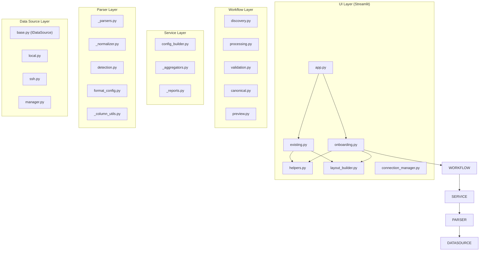
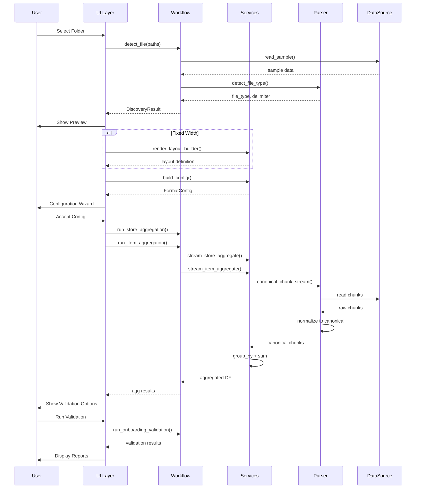
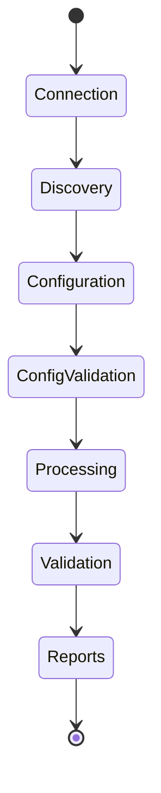
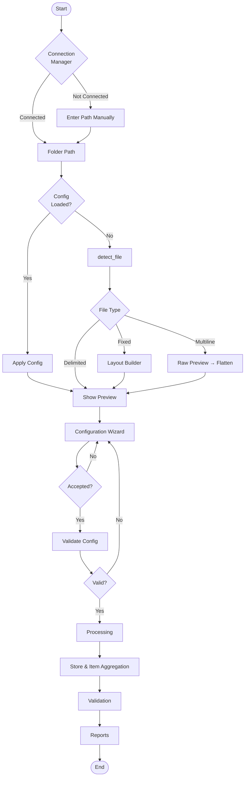
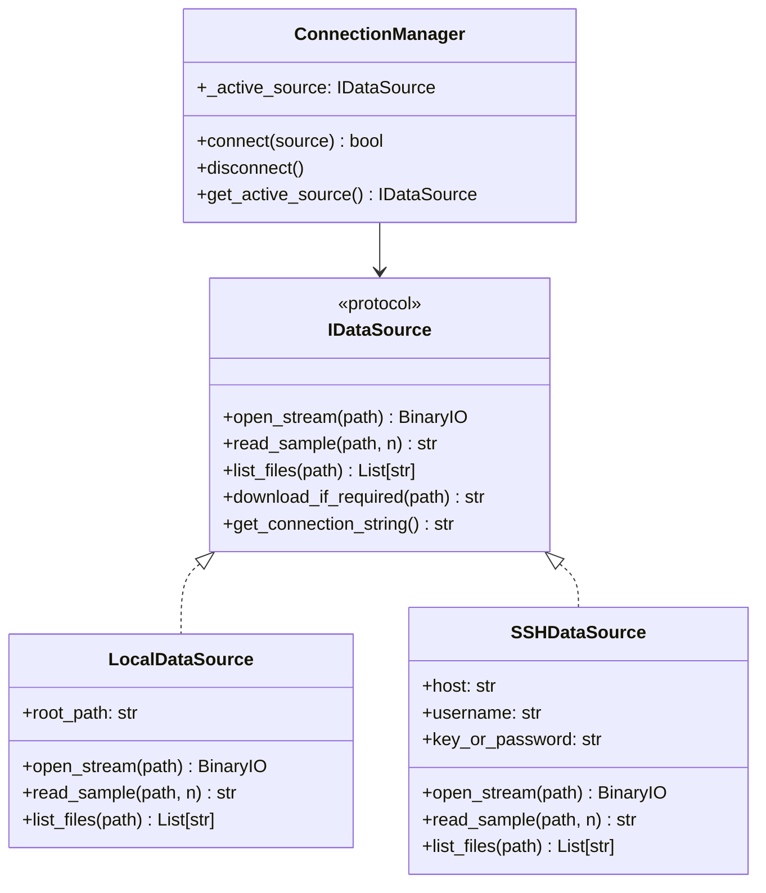
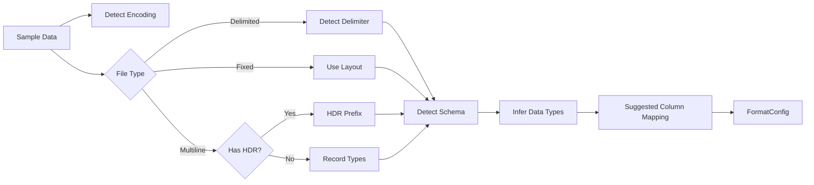
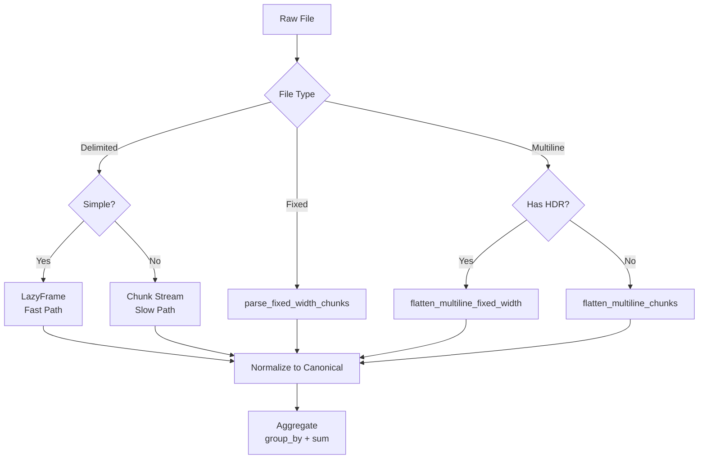

# Architecture Diagrams

## Architecture Overview

```mermaid
graph TB
    subgraph UI["UI Layer (Streamlit)"]
        APP["app.py"]
        ONB["onboarding.py"]
        EX["existing.py"]
        HELP["helpers.py"]
        LB["layout_builder.py"]
        CM["connection_manager.py"]
    end

    subgraph Workflow["Workflow Layer"]
        DISC["discovery.py"]
        PROC["processing.py"]
        VAL["validation.py"]
        CAN["canonical.py"]
        PREV["preview.py"]
    end

    subgraph Service["Service Layer"]
        CB["config_builder.py"]
        AGG["_aggregators.py"]
        REP["_reports.py"]
    end

    subgraph Parser["Parser Layer"]
        PAR["_parsers.py"]
        NORM["_normalizer.py"]
        DET["detection.py"]
        FC["format_config.py"]
        CU["_column_utils.py"]
    end

    subgraph DataSource["Data Source Layer"]
        BASE["base.py (IDataSource)"]
        LOCAL["local.py"]
        SSH["ssh.py"]
        MGR["manager.py"]
    end

    APP --> ONB
    APP --> EX
    ONB --> HELP
    ONB --> LB
    ONB --> WORKFLOW
    EX --> HELP
    EX --> LB
    WORKFLOW --> SERVICE
    SERVICE --> PARSER
    PARSER --> DATASOURCE
```

## Pipeline Flow

```mermaid
sequenceDiagram
    participant U as User
    participant UI as UI Layer
    participant W as Workflow
    participant S as Services
    participant P as Parser
    participant D as DataSource

    U->>UI: Select Folder
    UI->>W: detect_file(paths)
    W->>D: read_sample()
    D-->>W: sample data
    W->>P: detect_file_type()
    P-->>W: file_type, delimiter
    W-->>UI: DiscoveryResult
    UI->>U: Show Preview

    alt Fixed Width
        UI->>S: render_layout_builder()
        S-->>UI: layout definition
    end

    UI->>S: build_config()
    S-->>UI: FormatConfig
    UI->>U: Configuration Wizard
    U->>UI: Accept Config

    UI->>W: run_store_aggregation()
    UI->>W: run_item_aggregation()
    W->>S: stream_store_aggregate()
    W->>S: stream_item_aggregate()
    S->>P: canonical_chunk_stream()
    P->>D: read chunks
    D-->>P: raw chunks
    P->>P: normalize to canonical
    P-->>S: canonical chunks
    S->>S: group_by + sum
    S-->>W: aggregated DF
    W-->>UI: agg results

    UI->>U: Show Validation Options
    U->>UI: Run Validation
    UI->>W: run_onboarding_validation()
    W-->>UI: validation results
    UI->>U: Display Reports
```

## Workflow Phases

```mermaid
stateDiagram-v2
    [*] --> Connection
    Connection --> Discovery
    Discovery --> Configuration
    Configuration --> ConfigValidation
    ConfigValidation --> Processing
    Processing --> Validation
    Validation --> Reports
    Reports --> [*]
```

## Onboarding Flow

```mermaid
flowchart TD
    START([Start]) --> CM{Connection<br>Manager}
    CM -->|Connected| FP[Folder Path]
    CM -->|Not Connected| NOCM[Enter Path Manually]
    NOCM --> FP
    FP --> DET{Config<br>Loaded?}
    DET -->|Yes| APPLY[Apply Config]
    DET -->|No| DETECT[detect_file]
    APPLY --> PREVIEW[Show Preview]
    DETECT --> TYPE{File Type}
    TYPE -->|Delimited| PREVIEW
    TYPE -->|Fixed| LB[Layout Builder]
    LB --> PREVIEW
    TYPE -->|Multiline| ML[Raw Preview → Flatten]
    ML --> PREVIEW
    PREVIEW --> CONFIG[Configuration Wizard]
    CONFIG --> ACCEPT{Accepted?}
    ACCEPT -->|No| CONFIG
    ACCEPT -->|Yes| VALIDATE_CONFIG[Validate Config]
    VALIDATE_CONFIG --> OK{Valid?}
    OK -->|No| CONFIG
    OK -->|Yes| PROCESS[Processing]
    PROCESS --> AGG[Store & Item Aggregation]
    AGG --> VALIDATION[Validation]
    VALIDATION --> REPORTS[Reports]
    REPORTS --> END([End])
```

## Connection Layer

```mermaid
classDiagram
    class IDataSource {
        <<protocol>>
        +open_stream(path) BinaryIO
        +read_sample(path, n) str
        +list_files(path) List[str]
        +download_if_required(path) str
        +get_connection_string() str
    }
    class LocalDataSource {
        +root_path: str
        +open_stream(path) BinaryIO
        +read_sample(path, n) str
        +list_files(path) List[str]
    }
    class SSHDataSource {
        +host: str
        +username: str
        +key_or_password: str
        +open_stream(path) BinaryIO
        +read_sample(path, n) str
        +list_files(path) List[str]
    }
    class ConnectionManager {
        +_active_source: IDataSource
        +connect(source) bool
        +disconnect()
        +get_active_source() IDataSource
    }
    IDataSource <|.. LocalDataSource
    IDataSource <|.. SSHDataSource
    ConnectionManager --> IDataSource
```

## Configuration Builder

```mermaid
flowchart LR
    SAMPLE[Sample Data] --> ENC[Detect Encoding]
    SAMPLE --> TYPE{File Type}
    TYPE -->|Delimited| DET_DELIM[Detect Delimiter]
    TYPE -->|Fixed| DET_FW[Use Layout]
    TYPE -->|Multiline| DET_ML{Has HDR?}
    DET_ML -->|Yes| HDR[HDR Prefix]
    DET_ML -->|No| RT[Record Types]
    DET_DELIM --> SCHEMA[Detect Schema]
    DET_FW --> SCHEMA
    HDR --> SCHEMA
    RT --> SCHEMA
    SCHEMA --> INFER[Infer Data Types]
    INFER --> MAPPING[Suggested Column Mapping]
    MAPPING --> CFG[FormatConfig]
```

## Data Access Strategy

```mermaid
flowchart TD
    RAW[Raw File] --> TYPE{File Type}
    TYPE -->|Delimited| CSV{Simple?}
    CSV -->|Yes| FAST[LazyFrame<br>Fast Path]
    CSV -->|No| SLOW[Chunk Stream<br>Slow Path]
    TYPE -->|Fixed| FW[parse_fixed_width_chunks]
    TYPE -->|Multiline| ML{Has HDR?}
    ML -->|Yes| HDR[flatten_multiline_fixed_width]
    ML -->|No| DML[flatten_multiline_chunks]
    FAST --> NORM[Normalize to Canonical]
    SLOW --> NORM
    FW --> NORM
    HDR --> NORM
    DML --> NORM
    NORM --> AGG[Aggregate<br>group_by + sum]
```
