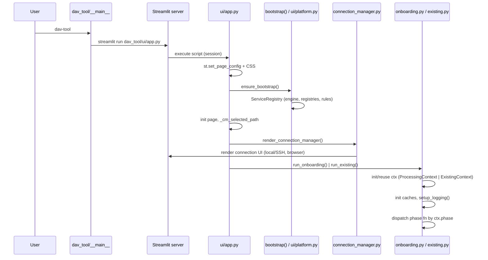

# Application Bootstrap

How the DVA Platform starts, from CLI to a rendered Streamlit page.

---

## 1. Entry Points

| Entry point | Mechanism |
|-------------|-----------|
| `dav-tool` console script | `pyproject.toml` → `dav_tool.__main__:main` |
| `python -m dav_tool` | runs `dav_tool/__main__.py` |
| `streamlit run dav_tool/ui/app.py` | direct Streamlit launch (Dockerfile uses this) |

### `dav_tool/__main__.py` (13 lines)

```python
def main():
    sys.argv = ["streamlit", "run", APP_PATH, *sys.argv[1:]]
    sys.exit(stcli.main())
```

`APP_PATH = "dav_tool/ui/app.py"`. The console entry point simply rewrites argv and
delegates to `streamlit.web.cli.main()`. Everything downstream is standard Streamlit:
the server starts, and on each browser session (re)run the script at
`dav_tool/ui/app.py` executes top-to-bottom.

---

## 2. Startup Sequence

```
CLI (dav-tool | python -m dav_tool | streamlit run)
  ↓
streamlit.web.cli.main()  → starts Streamlit server
  ↓
browser session opens → server executes dav_tool/ui/app.py top-to-bottom
  ↓
1. st.set_page_config(page_title="DVA Platform", layout="wide")   (app.py:7)
  ↓
2. ensure_bootstrap()  (app.py → ui/platform.py → pipeline/bootstrap.py)
     - initializes the DVA Platform exactly once (idempotent):
       config, observability, parser_registry, parser_factory,
       pipeline_registry (5 standard pipelines), rule_registry (9 rules),
       workflow_engine
     - stores the ServiceRegistry + WorkflowEngine in session state
       (_platform_services, _workflow_engine)
  ↓
3. Session state initialization:
     st.session_state.page            = "existing"     (app.py:9-10)
     st.session_state._cm_selected_path = ""           (app.py:11-12)
  ↓
4. Inline CSS (button font-weight) via st.markdown(unsafe_allow_html=True)  (app.py:14-23)
  ↓
5. render_connection_manager()   (app.py:25 → ui/connection_manager.py)
     - connects to the singleton DataSource (Local or SSH)  → datasource/manager.py
     - sets up file browser, workflow selector, path selection
  ↓
6. Page toggle (app.py:33-42):
     [Onboarding]  → st.session_state.page = "onboarding"
     [Format Change] → st.session_state.page = "existing"
  ↓
7. Dispatch (app.py:44-47):
     page == "onboarding" → run_onboarding()  (ui/onboarding.py)
     else                 → run_existing()     (ui/existing.py)
```

### Note on "logging initialization"

There is **no global logging setup at startup**. `setup_logging()` in
`_observability.py:172` (idempotent `[DVA]` StreamHandler on the `dva` logger) is called
per-flow — see `ui/onboarding.py` and `ui/existing.py` `run()` functions — not at module
import time. `log_phase()` emits `[Phase]` messages.

### Note on "configuration loading"

There is **no application-level config file** at startup. The only "configuration" is:

- `dav_tool/config.py` — module constants (`DEFAULT_ENCODING="cp1252"`,
  `FALLBACK_ENCODING="utf8-lossy"`, `DEFAULT_CHUNK_SIZE=100_000`,
  `DEFAULT_PREVIEW_ROWS=20`, `DELIMITERS=[",","|","\t",";"]`, `DEFAULT_LOG_LEVEL="INFO"`).
- `dav_tool/datasource/manager.py` — module-level singleton connection state.
- Per-workflow `FormatConfig` JSON files loaded later during Discovery/Configuration.

---

## 3. Onboarding `run()` (ui/onboarding.py:68)

1. Reads/reuses `st.session_state.onb_ctx` (a `ProcessingContext`), creating a fresh one
   if missing (L60, 74-78).
2. Initializes shared caches in session state: `_detection_cache`,
   `_column_name_cache`, `_preview_cache`, `execution_history` (L76-77).
3. `render_phase_progress(ctx.phase, on_reset=_reset_onboarding)` (L83) — custom HTML
   stepper.
4. Sidebar Developer Mode checkbox (L85) → `display_dev_diagnostics`.
5. `setup_logging()` (in `_reset_onboarding`).
6. Dispatches phase functions by `ctx.phase` (L90-104):
   - phase 1 → `_phase1_discovery`
   - phase 2 → `_phase2_configuration` (column mapping)
   - phase 3 → `_phase3_config_validation`
   - phase 4 → `_phase4_processing`
   - phase 5 → `_phase5_validation`
   - phase 6 → `_phase6_reports`

## 4. Format Change `run()` (ui/existing.py:72)

Same pattern with `st.session_state.ex_ctx` (an `ExistingContext`), 9 phases
(`PHASE_MIGRATION_REPORT = 9`), plus Developer Mode that also renders the
Certification Suite (L89-92).

---

## 5. Session State Initialization Summary

Initialized at module top-level (app.py):
- `page` → `"existing"`
- `_cm_selected_path` → `""`

Initialized on first `run()` of each flow:
- `onb_ctx` / `ex_ctx` (ProcessingContext / ExistingContext)
- `_detection_cache` (dict), `_column_name_cache`, `_preview_cache`, `execution_history`
- Connection Manager keys: `_cm_connected`, `_cm_conn_type`, `_cm_browse_path`,
  `_cm_browse_history`, `_cm_search`, `_cm_workflow`, `_cm_bau_path`, `_cm_test_path`,
  `_cm_expanded`, and per-browser browse/history/search keys.

---

## 6. Dependency / Service Initialization

The platform uses a **ServiceRegistry** created once by `bootstrap()` in
`pipeline/bootstrap.py`. The UI never constructs business objects directly; it
reads them via the presentation-layer accessor `ui/platform.py`
(`get_workflow_engine()`, `get_pipeline_registry()`, `get_rule_registry()`,
`get_parser_registry()`).

Services registered by `bootstrap()`:

- `config` — `dav_tool/config.py` module constants.
- `observability` — `dav_tool/_observability.py`.
- `parser_registry` — populated at import time by `parser/__init__.py`.
- `parser_factory` — `parser/factory.py` `default_factory`.
- `pipeline_registry` — 5 standard pipelines (`register_standard_pipelines`).
- `rule_registry` — 9 standard rules (`register_standard_rules`).
- `workflow_engine` — `WorkflowEngine(registry=pipeline_registry)`.

Still initialized outside the registry (legacy singletons):

- **DataSource** — `datasource/manager.py` module singleton
  (`_ACTIVE_SOURCE`, `_ACTIVE_CONFIG`, `_LOCK`); `connect_local()` / `connect_ssh()`
  replace the singleton.
- **ExecutionEngine** — lazy singleton in `workflow/orchestration.py`
  (`_get_engine()` → `ExecutionEngine()`).

---

## 7. Startup Diagram (Mermaid)



---

## 8. Facts Worth Noting

- **One Streamlit page.** There is no multipage app; "pages" are phase screens inside
  two functions toggled by the `page` session key.
- **`@st.cache_data` / `@st.cache_resource` are never used.** All caching is hand-rolled
  in session-state dicts (`_detection_cache`, `_column_name_cache`, `_preview_cache`,
  `_layout_builder_state`).
- **`st.progress` is never used.** Progress is a bespoke HTML pill stepper.
- **`st.rerun()` is used ~40 times** — the app is a mutate-session-state-then-rerun
  state machine.
