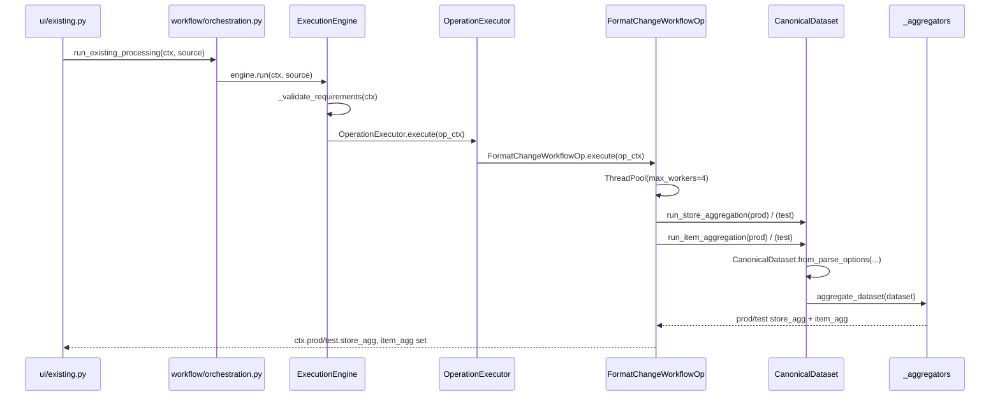

# Frontend ↔ Backend Integration

How the Streamlit UI communicates with the backend — page → workflow → service → parser
mapping, session state, caching, progress, callbacks, state transitions, and data
contracts.

---

## 1. Page → Workflow Mapping

| UI page/function | Workflow function(s) called | Service → Parser |
|------------------|------------------------------|-------------------|
| `ui/app.py` shell | `ensure_bootstrap()` (ui/platform.py → pipeline/bootstrap.py) — initializes the platform once and exposes `workflow_engine` + registries to pages | — |
| `ui/connection_manager.py` | `connect_local` / `connect_ssh` / `disconnect` / `is_connected` / `get_active_source` (datasource.manager) | — |
| `ui/onboarding.py` `_phase1_discovery` | `workflow.discovery.detect_file` (cached) | `detection.generate_detection_summary` |
| `ui/onboarding.py` `_multiline_flow` | `helpers.autoparse_context` | **`workflow.parsing.parse_from_discovery`** (via ParserFactory) — UI no longer reaches into the parser directly |
| `ui/onboarding.py` `_phase4_processing` | `workflow.orchestration.run_onboarding_processing` | ExecutionEngine → OperationExecutor → AggregateWorkflowOp → `workflow.processing.run_store/item_aggregation` → CanonicalDataset |
| `ui/onboarding.py` `_phase5_validation` | `workflow.orchestration.run_onboarding_validation` | `workflow.validation.run_onboarding_validation` → file review via `workflow.orchestration._generate_file_review` (Reporting) |
| `ui/onboarding.py` `_phase6_reports` | `workflow.output.generate_onboarding_output` | `_reports.generate_summary_analytics`, summary sheets |
| `ui/existing.py` `_phase1_discovery` | `workflow.discovery.detect_file` per side | detection |
| `ui/existing.py` `_phase_discovery_compare` | `workflow.discovery_compare.compare_discovery` | — |
| `ui/existing.py` `_phase_schema_compare` | `workflow.schema_comparison.compare_schemas` | — |
| `ui/existing.py` `_phase4_processing` | `workflow.orchestration.run_existing_processing` | ExecutionEngine → FormatChangeWorkflowOp (4 parallel aggregations) |
| `ui/existing.py` `_phase5_validation` | `workflow.orchestration.run_existing_validation` | `workflow.validation.run_existing_validation` → file reviews via `workflow.orchestration._generate_file_review` (Reporting) |
| `ui/existing.py` `_phase6_reports` | `workflow.output.generate_existing_output` | summary sheets |
| `ui/existing.py` `_phase7_migration_report` | `workflow.output.generate_migration_report` | schema/operation comparison + migration_report |
| `ui/helpers.py` `get_column_names` | `workflow.preview.parse_fixed_width_chunks` + `io.safe_read_csv` (direct) | `_parsers` |
| `ui/layout_builder.py` | `workflow.preview.preview_raw_lines` | `_parsers.preview_raw_lines` |
| `ui/certification_suite.py` | `certification.runner.CertificationRunner` | full pipeline |

**Parser return contract:** `ParsedResult` (parser/base.py:26) — `canonical_data` /
`metadata` / `discovery` / `record_tree` / `schema` / `warnings` / `_parsed_data`.
The UI consumes `expose_parsed_preview()` for the multiline schema editor.

---

## 2. Direct backend access from UI (import inventory highlights)

The UI never imports `detection.py`, `_parsers.py`, `flatten.py`, `quantity.py`, or
`_normalizer.py` directly. It does, however, import directly:

- `dav_tool.parser` (`default_factory`) — accessed only via the workflow facade
  `workflow.parsing.parse_from_discovery` in `helpers.autoparse_context`; the UI no
  longer constructs/selects parsers itself.
- `dav_tool.io.safe_read_csv` (helpers L28) — reads CSVs in the UI layer.
- `dav_tool.config_validator.validate_config` / `validate_section` (helpers, existing).
- `dav_tool._column_utils.smart_column_indices` / `find_best_column_index` (helpers).
- `dav_tool.config_builder.config_to_summary_dict` (helpers — used only by dead code).
- `pl.read_excel` / `pl.read_csv` (helpers.load_storelist, layout_builder).
- `dav_tool.certification.runner` (certification_suite).

---

## 3. Session State — Complete Key Inventory

### App shell
- `page` — `"onboarding" | "existing"`
- `_cm_selected_path` — selected folder for onboarding

### Connection Manager
`_cm_connected` (written, never read), `_cm_conn_type`, `_cm_browse_path`,
`_cm_browse_history`, `_cm_search`, `_cm_workflow`, `_cm_bau_path`, `_cm_test_path`,
`_cm_bau_browse_path/_history/_search`, `_cm_test_browse_path/_history/_search`,
`_cm_expanded`, `_cm_discovery` / `_cm_bau_discovery` / `_cm_test_discovery`
(**read but never written → dead discovery-consumption path**), `_cm_file_paths`
(written, never read). Plus Streamlit widget keys (`cm_host`, `cm_port`, `cm_user`, ...).

### Shared caches
- `_detection_cache` — dict keyed by `md5(sorted(file_paths))` (onboarding) or
  `md5(...) + "_{side}"` (existing)
- `_column_name_cache` (`_COLUMN_CACHE_KEY`) — LRU-ish, max 50 entries
- `_preview_cache` (`_PREVIEW_CACHE_KEY`) — max 50 entries
- `execution_history` — capped at `MAX_HISTORY = 10`
- `_layout_builder_state` — per-prefix layout rows

### Onboarding
`onb_ctx` (ProcessingContext), `onb_dev_mode`, `onb_folder_path`, `onb_config_file`,
`onb_cfg_store/upc/desc/units/price/pt/imp_dol/imp_unt`, `onb_cfg_accepted`,
`onb_proc_store/upc/desc/units/price`, `onb_storelist_path`, `onb_storelist_delim`,
`onb_save_config_path`, `onb_parsed_schema_{i}`, `onb_parsed_apply_schema`, `onb_redetect`.

### Existing
`ex_ctx` (ExistingContext), `ex_dev_mode`, `ex_bau_folder_path`, `ex_test_folder_path`,
`ex_bau_config_file`, `ex_test_config_file`, `ex_bau_prev_path`, `ex_test_prev_path`,
`ex_bau_detection_failed`, `ex_test_detection_failed`, `ex_bau_retry`, `ex_bau_manual`,
`ex_test_retry`, `ex_test_manual`, `ex_bau_redetect`, `ex_test_redetect`,
`ex_prod_*`/`ex_test_*` (store/upc/desc/units/price/pt/imp_dol/imp_unt),
`store_prod/units_prod/price_prod/upc_prod/desc_prod/price_bau/imp_dol_prod/imp_unt_prod`
(duplicate mapping block), `ex_schema_prod_{i}`/`ex_schema_test_{i}`/`ex_apply_schema`.

### Certification
`cert_cat`, `cert_ret`.

---

## 4. Caching

- **No `@st.cache_data` / `@st.cache_resource` anywhere.** All caching is hand-rolled in
  session state.
- `_detection_cache`: avoids re-running `detect_file` for the same sorted file paths.
- `_column_name_cache` / `_preview_cache`: keyed by
  `md5(paths|file_type|delimiter|layout|n_rows|start_line|record_type|source_id)` with FIFO
  eviction at 50 entries.
- Cache keys include `id(source)` (`_source_id`) but **not the source identity in the
  detection cache** — local vs SSH results for identical paths could collide.

---

## 5. Progress, Callbacks, Spinners

- **Progress:** `render_phase_progress(ctx.phase, ...)` (helpers.py:942) — a custom HTML
  pill stepper using `PHASE_LABELS`/`PHASE_ICONS` from `workflow/__init__.py`. There is
  **no `st.progress`**.
- **Callbacks:** exactly **one** — the file-browser path input
  `on_change=lambda: _navigate_to_path(...)` (connection_manager.py:346).
- **Spinners:** connection (L166, L224), aggregation (onboarding L618, existing L768),
  validation (L715, L933), certification runs (L47/53/60).
- **`st.rerun()`:** ~40 call sites — standard "mutate session state then rerun" pattern.

---

## 6. State Transitions

`ctx.phase` is an **integer** mutated directly by UI code. Phase constants:

- Onboarding: `PHASE_DISCOVERY=1` ... `PHASE_REPORTS=6` — now aligned 1:1 with the
  workflow-owned `WorkflowPhase` enum (`workflow/__init__.py:19`), so the UI's phase ints
  are the workflow's phase ints.
- Existing: 9 phases, `PHASE_MIGRATION_REPORT=9` (existing.py:39-47).

Transitions happen at buttons (e.g. "Accept Mapping →" sets phase 3, "Proceed to
Processing →" sets phase 4). The declared `WorkflowState` class
(`workflow/__init__.py:63`) is **not yet the live driver** — the UI still mutates
`ctx.phase` directly. Onboarding phase values already match `WorkflowPhase`, so
`WorkflowState` can become the driver without changing rendering. Existing's 9-phase
scheme needs a mapping to the 7 `WorkflowPhase` values before the same migration applies.

---

## 7. Data Contracts (what crosses the UI boundary)

| Contract | Crossing | Notes |
|----------|----------|-------|
| `ProcessingContext` / `ExistingContext` | both ways | UI reads/writes most fields directly |
| `DiscoveryResult` | backend → UI | stored on `ctx.discovery`; also rebuilt by UI (`DiscoveryResult.from_context`) |
| `ParsedResult` | backend → UI | via `autoparse_context` / `expose_parsed_preview()` |
| `FormatConfig` | both ways | load from JSON (UI), apply to ctx; save from ctx |
| `ValidationResult` | backend → UI | results copied onto ctx by orchestration |
| `OutputResult` | backend → UI | DataFrames + CSV strings rendered/downloaded |
| `MigrationReport` | backend → UI | JSON string download |
| `ProcessingMetrics` | backend → UI | displayed in expanders |

---

## 8. No Hidden Interactions — Known Leaks

1. ~~**UI → ParserFactory direct call**~~ — **RESOLVED (H2):** UI now goes through
   `workflow.parsing.parse_from_discovery` in `helpers.autoparse_context`.
2. **UI performs business-rule validation** — `helpers.validate_column_mapping`
   (L277-296) and `layout_builder._validate_layout`/`_check_overlaps` (L92-133).
3. **UI reads files directly** — `safe_read_csv`, `pl.read_excel`, `pl.read_csv`
   (helpers, layout_builder); connection-manager raw sample reads (L455-464).
4. **UI splices detection results into the context manually** instead of using
   `DiscoveryResult.apply_to_context` (used only by certification runner).
5. **Dead CM discovery hand-off** — `_cm_discovery`/`_cm_bau_discovery`/
   `_cm_test_discovery` are read but never written, so the intended
   "consume CM DiscoveryResult — no re-detection" path never executes.
6. **Local `os.path.exists` on remote paths** — onboarding L296, existing L172/L242.

---

## 9. Sequence Diagram (Frontend ↔ Backend, Format Change processing)

