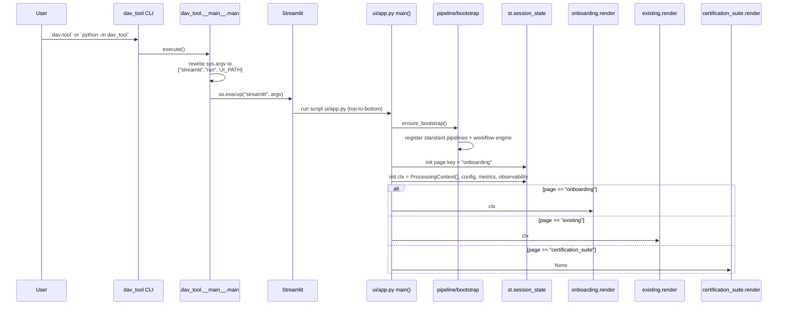
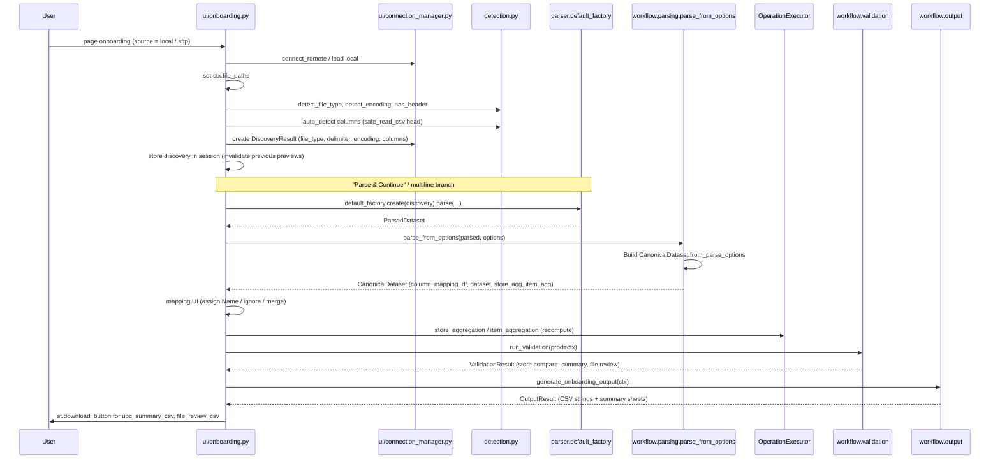
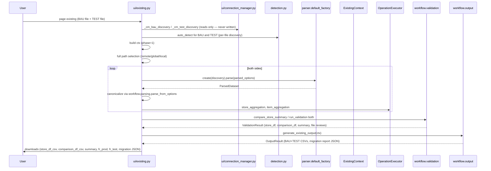
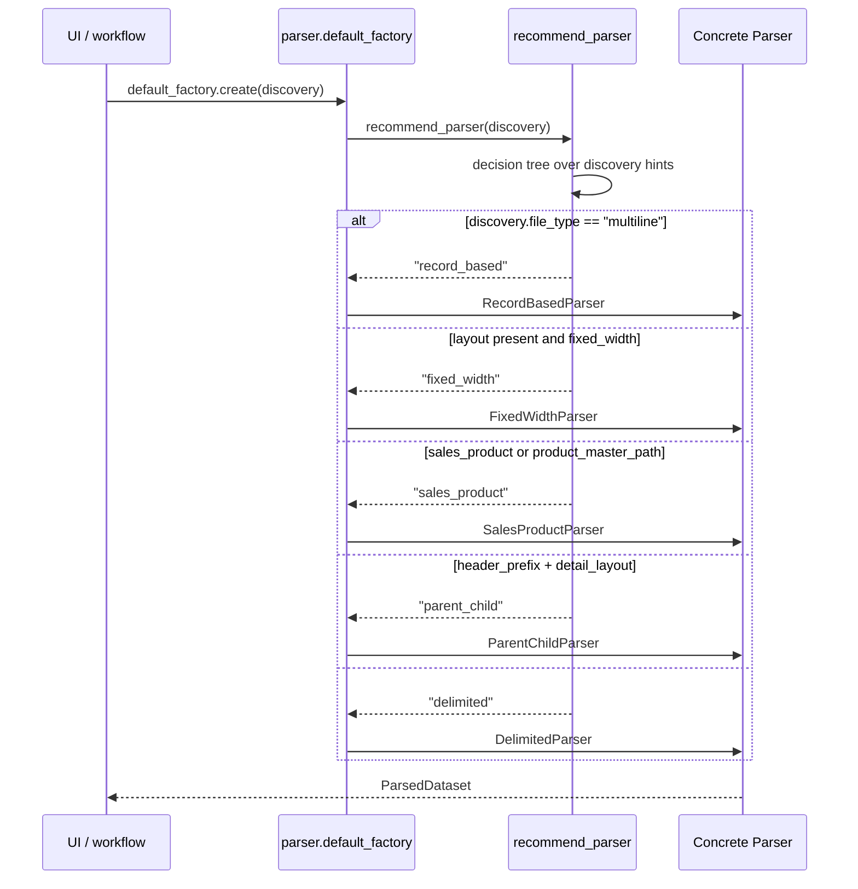
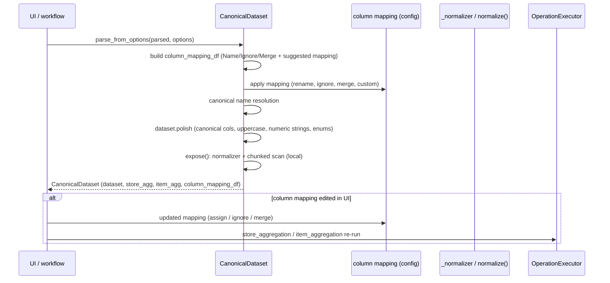
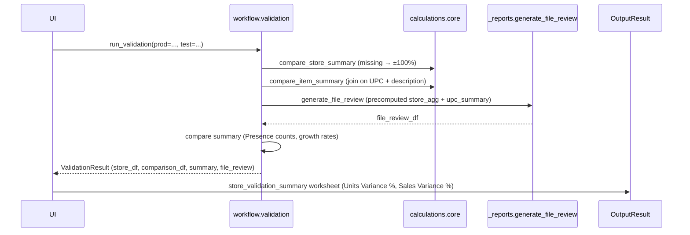
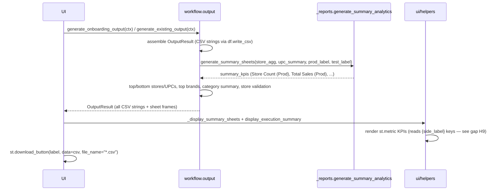
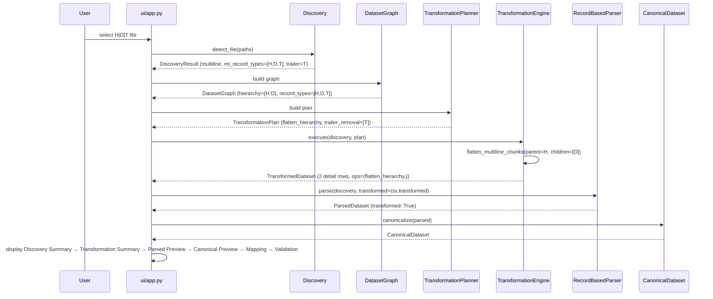

# Sequence Diagrams

Detailed Mermaid sequence diagrams for every Phase-15 interaction, traced from the
actual implementation.

Legend: `ctx` = `ProcessingContext` / `ExistingContext`; actor names match the real
modules. "SIDE" = the store side (Onboarding) or the BAU/TEST pair (Existing).

---

## 1. Application Startup



Notes:
- Pipeline bootstrap (standard pipelines + workflow engine) runs at app
  startup via `dav_tool/pipeline/bootstrap.py` (see `Application_Bootstrap.md`).
- Logging/metrics/observability are initialized **inside** the session context object
  (ProcessingContext), not at app import time.

---

## 2. Onboarding Workflow



---

## 3. Existing Workflow (Format Change)



---

## 4. Discovery

```mermaid
sequenceDiagram
    participant UI as UI caller
    participant D as detection.py
    participant R as DiscoveryResult
    participant Rec as parser.recommend_parser

    UI->>D: detect_file_type(path, datasource)
    D->>D: read first chunk; headerless guess
    D-->>UI: "delimited" | "fixed_width" | "excel" | "multiline"
    UI->>D: detect_encoding(path)
    D-->>UI: "cp1252" | "utf-8"
    UI->>D: delimiter scoring (comma/tab/semicolon/caret/pipe)
    D-->>UI: delimiter + has_header
    UI->>D: detect_trailer_prefix / detect_hdr_prefix / detect_record_types
    UI->>D: detect_record_length + detect_candidate_layout (fixed width)
    UI->>D: is_multiline_record + detect_multiline_record_types (HEB)
    UI->>R: assemble DiscoveryResult(32 fields)
    R-->>UI: discovery
    UI->>Rec: recommend_parser(discovery)
    Rec-->>UI: recommended_parser ("delimited"|"fixed_width"|"multiline"|"record_based"|"sales_product")
    UI->>UI: store discovery in ctx.session / _discovery cache
```

---

## 5. Parser Selection



---

## 6. Record-Based Parsing (HEB)

```mermaid
sequenceDiagram
    participant P as RecordBasedParser
    participant F as File (open)
    participant Tree as RecordTree
    participant C as canonical_chunk_stream (engine path) OR in-memory flatten

    P->>F: _open() (hardcoded utf-8)
    P->>P: build tree from file_paths[0]
    Note over P,Tree: parent keys: HDR; detail keys: S/U; boundary: T (trailer)
    P->>Tree: add_record(row) for each line
    Tree-->>P: RecordTree
    P->>P: flatten tree → details list
    P-->>UI: ParsedDataset (raw columns: S/U fields)
```

Intended architecture vs implementation:
- **Intended:** chunked streaming flatten then canonicalization.
- **Actual:** full file → Python RecordTree → list → DataFrame (in-memory); only
  `file_paths[0]` is parsed; encoding is hardcoded utf-8 (app default is cp1252).

---

## 7. Canonical Mapping



Divergence note: the parser-driven path `from_discovery` streams raw parser output and
**does not apply** the canonical normalization/renaming that `from_parse_options`
applies.

---

## 8. Validation



Layer-violation note: Validation invokes Report generation directly (crosses the
Validation → Reports boundary).

---

## 9. Report Generation & Downloads



---

## 10. Frontend ↔ Backend Communication

```mermaid
sequenceDiagram
    participant UI as Streamlit pages
    participant SS as st.session_state
    participant Backend as workflow/operations/validation/output
    participant Parser as parser.*
    participant Cache as hand-rolled caches (id(source) keys)

    UI->>SS: read/write ctx.phase, config, session
    UI->>Backend: direct service calls (parse_from_options, aggregate, validate, output)
    Backend->>Parser: create(discovery).parse(...) (via UI bypass, gap H2)
    Parser-->>Backend: ParsedDataset
    Backend-->>UI: CanonicalDataset / OutputResult / ValidationResult
    UI->>Cache: preview caches keyed by id(source) (no st.cache_data)
    UI->>UI: navigation via page radio; progress via st.progress + metrics
```

Communication contract summary:
- **Data contracts:** `DiscoveryResult` → `ParsedDataset` → `CanonicalDataset` →
  `OutputResult`; session-level `ProcessingContext` / `ExistingContext`.
- **Caching:** hand-rolled per-session dicts; no `st.cache_data`/`st.cache_resource`.
- **Progress:** phase numbers + `st.progress`; execution metrics written to
  `ctx.session` and rendered by `display_execution_summary`.

---

## 11. Data Pipeline (Sprint 3) — Full Chain

The new data-centric pipeline (`dav_tool/pipeline/`). Every standard pipeline
shares this exact chain; only Discovery and the TransformationPlan differ.

```mermaid
sequenceDiagram
    participant App as ui/app.py
    participant Boot as pipeline/bootstrap
    participant Reg as pipeline/registry
    participant Eng as WorkflowEngine
    participant Con as ConnectionStage
    participant Disc as DiscoveryStage
    participant G as DatasetGraphStage
    participant Plan as TransformationPlanningStage
    participant T as TransformationEngineStage
    participant Par as ParserPipelineStage
    participant Can as CanonicalDatasetStage
    participant Agg as AggregationStage
    participant Val as ValidationStage
    participant Rep as ReportingStage

    App->>Boot: ensure_bootstrap()
    Boot->>Reg: register_standard_pipelines(reg, full=True)
    App->>Eng: get_workflow_engine()
    App->>Eng: engine.run(ctx)
    Eng->>Con: run(ctx)
    Con-->>Eng: ctx.connection (ConnectionResult)
    Eng->>Disc: run(ctx)
    Disc-->>Eng: ctx.discovery (DiscoveryResult)
    Eng->>G: run(ctx)
    G-->>Eng: ctx.graph (DatasetGraph: nodes, relationships, hierarchy, record_types, layout)
    Eng->>Plan: run(ctx)
    Plan-->>Eng: ctx.plan (TransformationPlan: flatten/join/removal ops)
    Eng->>T: run(ctx)
    T-->>Eng: ctx.transformed (TransformedDataset: reshaped records)
    Eng->>Par: run(ctx) with transformed=ctx.transformed
    Par-->>Eng: ctx.parsed (ParsedDataset)
    Eng->>Can: run(ctx)
    Can-->>Eng: ctx.canonical (CanonicalDataset)
    Eng->>Agg: run(ctx)
    Agg-->>Eng: ctx.aggregated (AggregatedDataset)
    Eng->>Val: run(ctx)
    Val-->>Eng: ctx.validation (ValidationDataset)
    Eng->>Rep: run(ctx)
    Rep-->>Eng: ctx.report (ReportDataset)
    Eng-->>App: PipelineRun (stages_completed, metrics)
```

Notes:
- The engine only orchestrates; every stage owns its business logic.
- Fatal stage failures stop the run; recoverable transformation failures
  (missing product master, missing join key, flatten errors) become
  `TransformedDataset.warnings` and the pipeline continues.
- All five standard pipelines (`standard_delimited`, `fixed_width`,
  `record_based`, `sales_product`, `excel`) share this chain via
  `standard_pipelines.py::_base_stages`.

---

## 12. HEB Record-Based Flow (Sprint 3)

Replaces the rejected `Discovery → UI → Flatten → Parser` flow. Zero manual
interaction — the user is never asked for a record prefix, flatten toggle,
hierarchy, or parser type.


